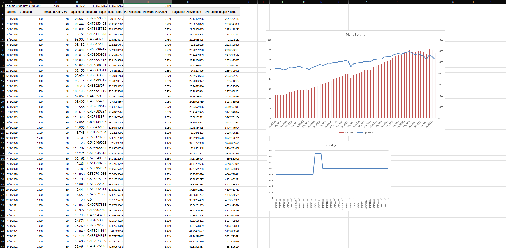
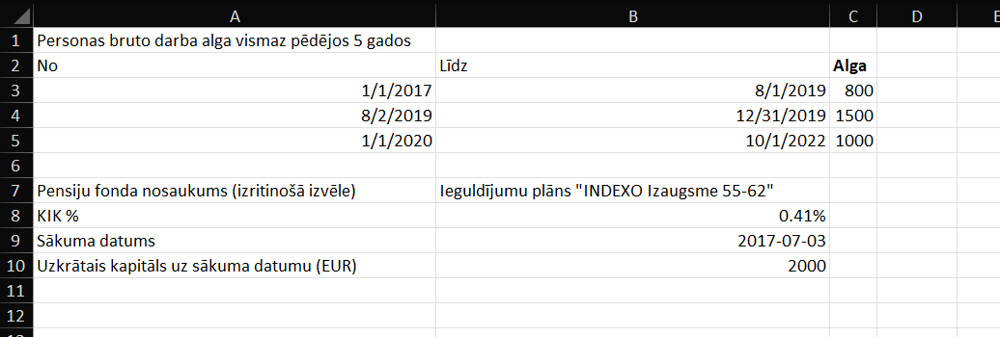
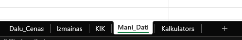

# Pensiju Kalkulators Excel

Excel-based pension accumulation calculator built as a financial modeling and spreadsheet engineering project.

The workbook estimates how pension savings can grow over time based on:

- historical pension fund unit prices
- selected pension plan
- management fee rate (KIK)
- salary history across multiple periods
- starting capital on the selected start date

The model calculates monthly contributions, purchased units, fee impact, accumulated value, and effective annual return.

## Preview

### Calculator Sheet

### Input Sheet

### Workbook Structure

## Files

- [`Pensiju_kalkulators.xlsx`](Pensiju_kalkulators.xlsx) - main Excel workbook
- [`README.md`](README.md) - project overview and usage notes

## Workbook Structure

The workbook contains five sheets:

- `Dalu_Cenas` - historical unit prices for multiple pension plans
- `Izmainas` - supporting historical changes dataset
- `KIK` - management fee table for available pension plans
- `Mani_Dati` - user input sheet with salary periods, selected fund, start date, and starting capital
- `Kalkulators` - main calculation sheet with monthly simulation, totals, return metrics, and charts

## Key Excel Techniques

- `INDEX` + `MATCH` for dynamic retrieval of fund prices and fee rates
- `EDATE` for month-by-month timeline generation
- array-based lookup to detect the first valid date for a selected pension plan
- cumulative unit and balance calculations across the contribution period
- fee modeling based on accumulated units
- `XIRR` for effective annual return estimation
- dropdown-based data validation for pension fund selection
- chart-based output for clearer interpretation

## What This Project Demonstrates

- financial modeling in Excel
- multi-sheet spreadsheet design
- dynamic lookup logic
- scenario-based analysis
- user-oriented input and output structure
- data-driven decision support

## How to Use

1. Open [`Pensiju_kalkulators.xlsx`](Pensiju_kalkulators.xlsx) in Microsoft Excel.
2. Go to the `Mani_Dati` sheet.
3. Enter or adjust:
   - salary periods
   - pension fund selection
   - start date
   - starting capital
4. Open the `Kalkulators` sheet to review:
   - monthly contribution flow
   - unit accumulation
   - fee impact
   - total accumulated pension value
   - charts and summary metrics

## Portfolio Positioning

This repository is intended as a portfolio project showing practical Excel skills beyond basic spreadsheets.

Recommended one-line description:

> Built an Excel-based pension calculator that simulates long-term accumulation using historical fund prices, contribution assumptions, management fees, and return analysis.

## Tech Stack

- Microsoft Excel
- Spreadsheet formulas
- Financial modeling logic

## Author

Made by `riet9`
